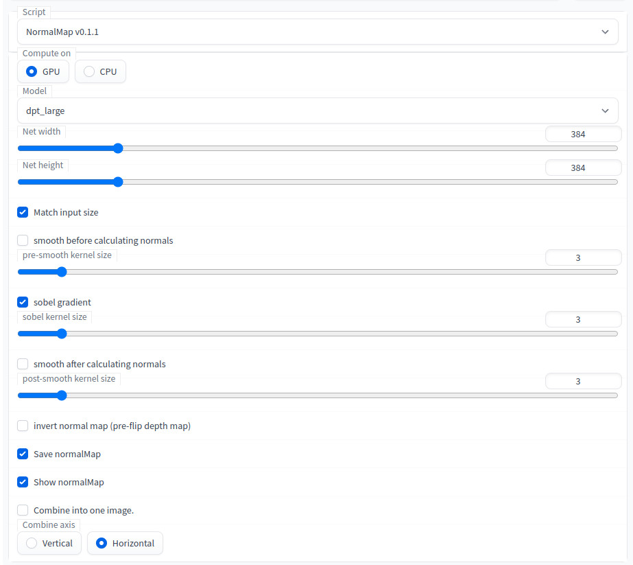

# Normal Maps for Stable Diffusion WebUI
This script is an addon for [AUTOMATIC1111's Stable Diffusion Web UI](https://github.com/AUTOMATIC1111/stable-diffusion-webui) that creates `normalmaps` from the generated images. Normal maps are helpful for giving flat textures a sense of depth with lighting.

To generate realistic normal maps from a single image, this script uses code and models from the [MiDaS](https://github.com/isl-org/MiDaS) repository by Intel ISL. See [https://pytorch.org/hub/intelisl_midas_v2/](https://pytorch.org/hub/intelisl_midas_v2/) for more info, or LeReS from the [AdelaiDepth](https://github.com/aim-uofa/AdelaiDepth) repository by Advanced Intelligent Machines. 

## Work in-progress
Should be functional.

Things to add/fix:
* Tiling can be improved (gradients could be matched).
* Implement bilateral filtering.
* I have not tested everything yet.
* Clean up ui more.

## Examples

Lighting

[](https://raw.githubusercontent.com/graemeniedermayer/stable-diffusion-webui-normalmap-script/main/examples/rocks.gif?raw=true)

Moving Camera

[](https://raw.githubusercontent.com/graemeniedermayer/stable-diffusion-webui-normalmap-script/main/examples/movcam.gif?raw=true)

example of blurring (with and without)

[](https://raw.githubusercontent.com/graemeniedermayer/stable-diffusion-webui-normalmap-script/main/examples/nogaus.gif?raw=true)[](https://raw.githubusercontent.com/graemeniedermayer/stable-diffusion-webui-normalmap-script/main/examples/gaus.gif?raw=true)

[](https://raw.githubusercontent.com/graemeniedermayer/stable-diffusion-webui-normalmap-script/main/examples.jpg?raw=true)

## Updates
* v0.1.2 bugfixes
    * brings everything up to depth map v0.2.3 (leReS included)
    * big depthmap update, experimental support for AdelaiDepth/LeReS (GPU Only!)
    * pre-scale depth slider

This was forked from v0.1.9 depth maps

> 💡 To update, only replace the `normalmap.py` script, and restart.

## Install instructions
In the WebUI, in the Extensions tab, in the Install from URL subtab, enter this repository https://github.com/graemeniedermayer/stable-diffusion-webui-normalmap-script and click install.
The midas repository will be cloned to /repositories/midas

The [BoostingMonocularDepth](https://github.com/compphoto/BoostingMonocularDepth) repository will be cloned to /repositories/BoostingMonocularDepth and added to sys.path

Model `weights` will be downloaded automatically on first use and saved to /models/midas or /models/leres

## Usage
Select the "NormalMap vX.X.X" script from the script selection box in either txt2img or img2img.


The model can `Compute on` GPU and CPU, use CPU if low on VRAM. 

Normal maps are calculated in two steps calculating a depth map and then estimating the normals. 

### Depth options

For calculated the depthmap there are five models available from the `Model` dropdown, the first four : dpt_large, dpt_hybrid, midas_v21_small, and midas_v21. See the [MiDaS](https://github.com/isl-org/MiDaS) repository for more info.

For the fifth model, res101, see [AdelaiDepth/LeReS](https://github.com/aim-uofa/AdelaiDepth/tree/main/LeReS) for more info. It can only compute on GPU at this time. The res101 model appears to sometimes create inverted normal maps so pay attention to whether greens are nearer to the top of rounded objects.

Net size can be set with `net width` and `net height`, or will be the same as the input image when `Match input size` is enabled. There is a trade-off between structural consistency and high-frequency details with respect to net size (see [observations](https://github.com/compphoto/BoostingMonocularDepth#observations)). Large maps will also need lots of VRAM.

### Normal estimations options

`pre-depth scale` pre-multiplies the depth map by this value before calculated normals. Larger values will create sharper normals and lower values will create smoother normals. For conventional images 1.0 is a good value.

`smooth before`, `sobel gradient`, and `smooth after` are helpful for smoothing normal map. The smoothing functions are gaussian blurs. Increasing the kernel numbers will smooth more but also remove details and blend edges. Currently looking into better smoothing methods. The kernels must be odd integers.

When enabled, `Invert NormalMap` will result in a normalmap that's calculated from a flipped depthmap. This is particularly useful for res101. In normal map images, rounded objects will have a green top, blues to the left, and reds to the right. If greens are appear at the bottom of rounded surfaces, this button should be clicked.

Regardless of global settings, `Save NormalMap` will always save the normalmap in the default txt2img or img2img directory with the filename suffix '_normal'. Generation parameters are saved with the image if enabled in settings.

To see the generated output in the webui `Show NormalMap` should be enabled. When using Batch img2img this option should also be enabled.

When `Combine into one image` is enabled, the normalmap will be combined with the original image, the orientation can be selected with `Combine axis`. (TODO: might of broken this while converting).

## FAQ

 * `Can I use this on existing images ?`
    - Yes, in img2img, set denoising strength to 0. This will effectively skip stable diffusion and use the input image. You will still have to set the correct size, and need to select `Crop and resize` instead of `Just resize` when the input image resolution does not match the set size perfectly.
 * `Can I run this on google colab ?`
    - You can run the MiDaS network on their colab linked here https://pytorch.org/hub/intelisl_midas_v2/ . 

## Acknowledgements

This is a modification of an awesome [depthmap repo](https://github.com/thygate/stable-diffusion-webui-depthmap-script) by thygate.

Initial depth to normal is based on this [stackoverflow](https://stackoverflow.com/questions/53350391/surface-normal-calculation-from-depth-map-in-python) answer =.

This project uses code and information from following papers :

MiDaS :

```
@ARTICLE {Ranftl2022,
    author  = "Ren\'{e} Ranftl and Katrin Lasinger and David Hafner and Konrad Schindler and Vladlen Koltun",
    title   = "Towards Robust Monocular Depth Estimation: Mixing Datasets for Zero-Shot Cross-Dataset Transfer",
    journal = "IEEE Transactions on Pattern Analysis and Machine Intelligence",
    year    = "2022",
    volume  = "44",
    number  = "3"
}
```

Dense Prediction Transformers, DPT-based model :

```
@article{Ranftl2021,
	author    = {Ren\'{e} Ranftl and Alexey Bochkovskiy and Vladlen Koltun},
	title     = {Vision Transformers for Dense Prediction},
	journal   = {ICCV},
	year      = {2021},
}
```

AdelaiDepth/LeReS :

```
@article{yin2022towards,
  title={Towards Accurate Reconstruction of 3D Scene Shape from A Single Monocular Image},
  author={Yin, Wei and Zhang, Jianming and Wang, Oliver and Niklaus, Simon and Chen, Simon and Liu, Yifan and Shen, Chunhua},
  journal={TPAMI},
  year={2022}
}
@inproceedings{Wei2021CVPR,
  title     =  {Learning to Recover 3D Scene Shape from a Single Image},
  author    =  {Wei Yin and Jianming Zhang and Oliver Wang and Simon Niklaus and Long Mai and Simon Chen and Chunhua Shen},
  booktitle =  {Proc. IEEE Conf. Comp. Vis. Patt. Recogn. (CVPR)},
  year      =  {2021}
}
```

Boosting Monocular Depth Estimation Models to High-Resolution via Content-Adaptive Multi-Resolution Merging :

```
@INPROCEEDINGS{Miangoleh2021Boosting,
author={S. Mahdi H. Miangoleh and Sebastian Dille and Long Mai and Sylvain Paris and Ya\u{g}{\i}z Aksoy},
title={Boosting Monocular Depth Estimation Models to High-Resolution via Content-Adaptive Multi-Resolution Merging},
journal={Proc. CVPR},
year={2021},
}